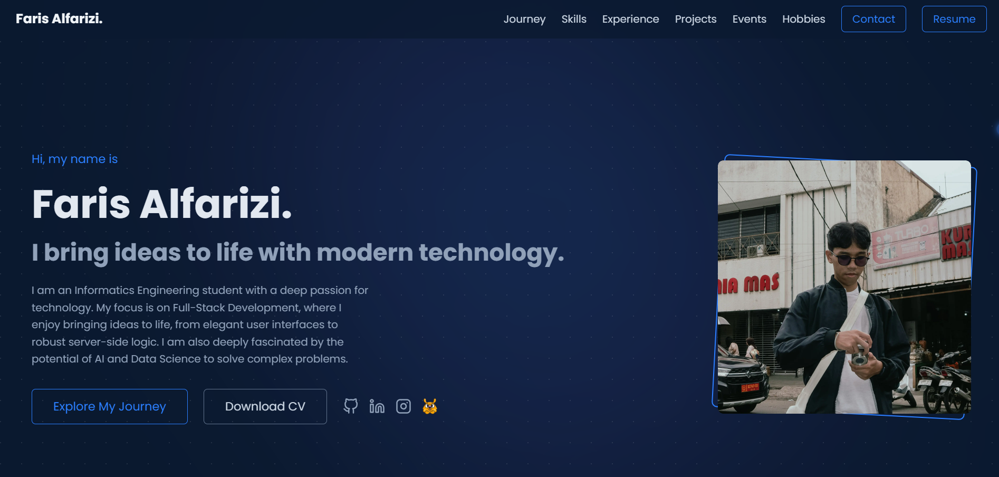

# My Interactive Personal Portfolio

[](https://nextjs.org/) [](https://tailwindcss.com/) [](https://vercel.com/)

A live portfolio showcasing my journey, skills, projects, and experiences as a developer. Built from scratch with a modern, interactive tech stack.

**Live Demo: [farisalfarizi.my.id](https://farisalfarizi.my.id/)**

---

 


## ✨ Features

- **Fully Responsive Design:** Optimized for all devices, from mobile to desktop.
- **Interactive Hero Section:** Featuring on-hover text effects and an autoplaying profile photo carousel.
- **Animated Career Timeline:** A scroll-based visualization of my journey as a developer.
- **Dynamic Image Sliders:** Showcases for Projects, Events, and Hobbies using Swiper.js with an autoplay-on-hover feature.
- **Smooth Animations:** Built with Framer Motion for fluid transitions and interactions.
- **Tabbed Experience Section:** A clean and interactive presentation of my work history.
- **Image Lightbox:** For detailed viewing of certifications.

## 🚀 Tech Stack

- **Framework:** Next.js
- **Language:** TypeScript
- **Styling:** Tailwind CSS
- **Animation:** Framer Motion
- **Slider/Carousel:** Swiper.js
- **Icons:** React Icons
- **Deployment:** Vercel
- **DNS & Performance:** Cloudflare

## 🛠️ Running Locally

To run this project on your own machine, follow these steps:

1.  **Clone the repository:**
    ```sh
    git clone [https://github.com/](https://github.com/)farisalfrz/portfolio-web.git
    ```
2.  **Navigate to the project directory:**
    ```sh
    cd portfolio-web
    ```
3.  **Install dependencies:**
    ```sh
    npm install
    ```
4.  **Run the development server:**
    ```sh
    npm run dev
    ```

Open [http://localhost:3000](http://localhost:3000) with your browser to see the result.

---
*Crafted with ❤️ by Faris Alfarizi*